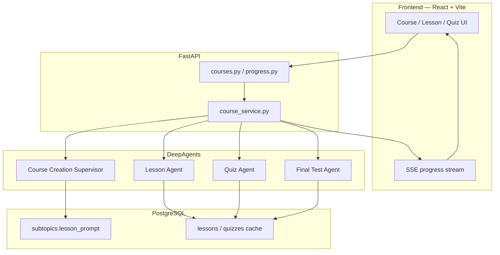
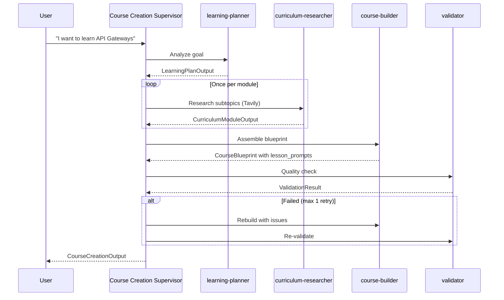

# AI Tutor

An adaptive learning platform that turns a learner's goal into a structured course — modules, subtopics, markdown lessons, quizzes, and module final tests — powered by [DeepAgents](https://github.com/langchain-ai/deepagents) on LangGraph.

The agent layer is the core of this project. Every learning artifact is produced by a DeepAgent with a typed Pydantic `response_format`, orchestrated through two deliberate patterns: a **multi-agent supervisor** for course creation and **single-shot direct agents** for on-demand content.

---

## Architecture at a glance



**Curriculum-first design:** quality is enforced once, at course creation. Each subtopic gets a rich `lesson_prompt` stored in the database. On-demand lesson generation is a single fast agent call that follows those instructions — no validation loop, no supervisor recursion.

---

## Why DeepAgents

DeepAgents wraps LangGraph with conventions that fit this product well:

| Capability | How we use it |
| --- | --- |
| `create_deep_agent()` | Factory for every agent — one function, one schema, one prompt |
| `response_format=SomeModel` | Structured JSON output via Pydantic; no manual parsing |
| `SubAgent` + supervisor prompt | Course creation delegates to specialized subagents via the built-in `task` tool |
| `tools=[...]` | Tavily web search on the curriculum researcher only |
| `ainvoke` / `astream_events` | Sync completion for tests; SSE streaming for user-facing flows |

All agents live under `backend/app/agents/ai_tutor/`. The API layer (`course_service.py`) invokes agents and handles persistence — agents stay framework-agnostic.

---

## Agent flows

### 1. Course creation — supervisor + subagents

The heaviest pipeline. A supervisor coordinates four specialized subagents, validates the result, and retries at most once.



**Defined in:** `orchestrator.py`

```python
create_deep_agent(
    model="openai:gpt-4o",
    system_prompt=COURSE_CREATION_SUPERVISOR_PROMPT,
    response_format=CourseCreationOutput,
    subagents=[
        SubAgent(name="learning-planner", ...),
        SubAgent(name="curriculum-researcher", tools=[internet_search], ...),
        SubAgent(name="course-builder", ...),
        SubAgent(name="validator", ...),
    ],
)
```

| Subagent | Role | Output schema |
| --- | --- | --- |
| `learning-planner` | Parse the learner's goal into topic, level, hours, module list | `LearningPlanOutput` |
| `curriculum-researcher` | Web search for syllabi, docs, bootcamps per module | `CurriculumModuleOutput` |
| `course-builder` | Write a detailed `lesson_prompt` for every subtopic | `CourseBlueprint` |
| `validator` | Check curriculum completeness and prompt quality | `ValidationResult` |

Hard limits in the supervisor prompt prevent runaway loops: **max 2** `course-builder` calls and **max 2** `validator` calls, then return the best blueprint available.

The blueprint is persisted to PostgreSQL. Each `Subtopic` row stores its `lesson_prompt` — this is the key artifact that makes on-demand generation fast and consistent.

---

### 2. On-demand lesson — single direct agent

Lessons are generated lazily when a learner opens a subtopic. If cached, the API returns JSON immediately. Otherwise it streams progress over SSE.

**Defined in:** `agents/on_demand_agent.py` → `make_lesson_agent()`

```python
create_deep_agent(
    model="openai:gpt-4o-mini",
    system_prompt=CONTENT_GENERATOR_PROMPT,
    response_format=LessonContent,
)
```

The user message is built from the stored curriculum:

```
Subtopic: 'Request Routing'
Level: Beginner

Generation instructions:
<lesson_prompt from database>

IMPORTANT: Write ALL output in English.
```

**Output schema** (`LessonContent`):

| Field | Format |
| --- | --- |
| `subtopic` | string |
| `introduction` | markdown, 1–2 sentences |
| `explanation` | markdown, 3–5 paragraphs with `###` headings, code fences, lists |

No validator, no subagents. Quality comes from the `lesson_prompt` written during course creation.

---

### 3. Quiz — single direct agent

Three multiple-choice questions per subtopic, generated after the lesson exists.

```python
create_deep_agent(
    model="openai:gpt-4o",
    system_prompt=QUIZ_GENERATOR_PROMPT,
    response_format=QuizOutput,
)
```

The prompt includes the lesson JSON so questions test actual content, not just the subtopic title.

---

### 4. Final test — single direct agent

~10 questions covering an entire module. Also a single direct agent — earlier multi-agent versions caused `GraphRecursionError` on longer flows.

```python
create_deep_agent(
    model="openai:gpt-4o",
    system_prompt=FINAL_TEST_PROMPT,
    response_format=FinalTestOutput,
)
```

---

### 5. Progress report — single direct agent

A separate agent (`agents/progress.py`) generates learner progress summaries. Same `create_deep_agent` + `response_format` pattern, invoked from `progress_service.py`.

---

## Streaming layer

User-facing generation endpoints return **Server-Sent Events**. The streaming module bridges LangGraph events to the frontend.

**Defined in:** `streaming.py`

| SSE event | Source |
| --- | --- |
| `agent_start` / `agent_end` | LangGraph `on_tool_start` / `on_tool_end` on the `task` tool (subagent delegation) |
| `lesson_delta` | Partial structured-output chunks while `LessonContent` streams in |
| `complete` | Final `structured_response` from `on_chain_end` |
| `error` | Agent produced no output |

```python
async for raw in agent.astream_events(agent_input, version="v2", config={"recursion_limit": 50}):
    ...
```

Lesson streaming passes `partial_tool_name="LessonContent"` so the frontend can render markdown progressively as the model fills in `introduction` and `explanation`.

Course creation streams subagent start/end events so the UI shows steps like "Researching curriculum…" and "Building course structure…".

---

## Structured outputs

Every agent returns typed Pydantic models — never free-form text that gets parsed later.

```
backend/app/agents/ai_tutor/schemas/
├── learning_plan.py      # LearningPlanOutput
├── curriculum.py         # CurriculumModuleOutput
├── course_blueprint.py   # CourseBlueprint, SubtopicBlueprint
├── course_creation.py    # CourseCreationOutput (plan + blueprint)
├── validation.py         # ValidationResult
├── lesson.py             # LessonContent
├── quiz.py               # QuizOutput, FinalTestOutput
└── progress.py           # ProgressReport
```

DeepAgents uses these schemas as the `response_format`, so the model's final message is already validated JSON. Extraction is a single line:

```python
output = result.get("structured_response")
```

---

## Tools

Only one custom tool is registered today:

| Tool | Agent | Purpose |
| --- | --- | --- |
| `internet_search` | `curriculum-researcher` | Tavily web search for syllabi, docs, and educational resources |

Defined in `tools/web_search.py`. Kept scoped to curriculum research — lessons and quizzes don't need live web access.

---

## Observability

All DeepAgents runs are auto-traced by LangSmith when these env vars are set (see `backend/.env.example`):

```
LANGSMITH_TRACING=true
LANGSMITH_API_KEY=lsv2_pt_...
LANGSMITH_PROJECT=ai-tutor
```

Traces show model, token usage, structured input/output, and subagent delegation depth. Docker Compose loads `backend/.env` via `env_file` on the backend service.

---

## Agent source layout

```
backend/app/agents/ai_tutor/
├── orchestrator.py              # Course creation supervisor + subagents
├── agents/
│   ├── on_demand_agent.py       # Lesson, quiz, final test factories
│   └── progress.py              # Progress report agent
├── prompts/
│   ├── course_creation_supervisor.py
│   ├── learning_planner.py
│   ├── curriculum_research.py
│   ├── course_builder.py
│   ├── validation.py
│   ├── content_generator.py
│   ├── quiz_generator.py
│   └── progress.py
├── schemas/                     # Pydantic response_format models
├── services/
│   ├── course_service.py        # Invokes agents, persists results, SSE generators
│   └── progress_service.py
├── streaming.py                 # LangGraph → SSE bridge
└── tools/
    └── web_search.py            # Tavily search for curriculum researcher
```

---

## Design decisions

**Supervisor for course creation, direct agents for everything else.**
Course creation is exploratory — it needs planning, research, assembly, and validation. Lessons, quizzes, and tests have a fixed input shape and a single output schema; adding a supervisor would add latency and recursion risk without improving quality.

**Validate at curriculum time, not at lesson time.**
The `validator` subagent checks blueprint completeness and `lesson_prompt` quality during course creation. On-demand agents trust the stored prompt. This cut lesson generation from a multi-agent loop to one LLM call.

**Cache generated content in PostgreSQL.**
Lessons, quizzes, and final tests are generated once per subtopic/module and stored as JSON. Subsequent requests return immediately — agents only run on cache miss.

**Model selection by task complexity.**

| Agent | Model | Rationale |
| --- | --- | --- |
| Course creation supervisor | `gpt-4o` | Multi-step coordination, tool use |
| Curriculum researcher | `gpt-4o` | Search result synthesis |
| Lesson generation | `gpt-4o-mini` | Rich input from `lesson_prompt`; fast, no reasoning overhead |
| Quiz / final test | `gpt-4o` | Question quality matters |
| Progress report | `gpt-4o` | Narrative synthesis |

---

## Quick start

**Prerequisites:** Docker, `OPENAI_API_KEY`, `TAVILY_API_KEY`

```bash
# Copy env files
cp backend/.env.example backend/.env   # fill in API keys
cp .env.example .env                   # root keys for compose interpolation

# Start everything
docker compose up --build
```

| Service | URL |
| --- | --- |
| Frontend | http://localhost:5173 |
| Backend API | http://localhost:8000 |
| API docs | http://localhost:8000/docs |

Enter a learning goal on the home page to trigger the course creation supervisor. Open any subtopic to trigger on-demand lesson generation with streaming.

For local (non-Docker) backend setup, env vars, and Render deployment, see [backend/README.md](backend/README.md).

---

## Tech stack

| Layer | Stack |
| --- | --- |
| Agents | DeepAgents 0.6+, LangGraph, LangChain OpenAI |
| Backend | FastAPI, SQLAlchemy (async), Alembic, PostgreSQL |
| Frontend | React, TypeScript, Vite, react-markdown |
| Search | Tavily |
| Observability | LangSmith (optional) |
